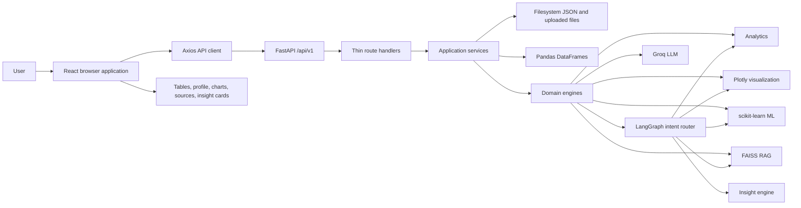
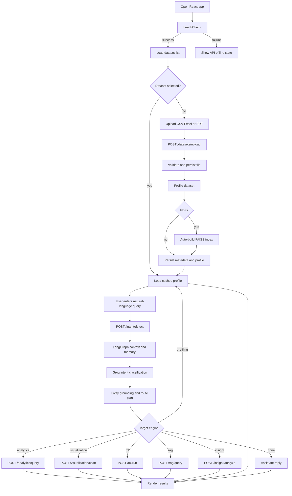
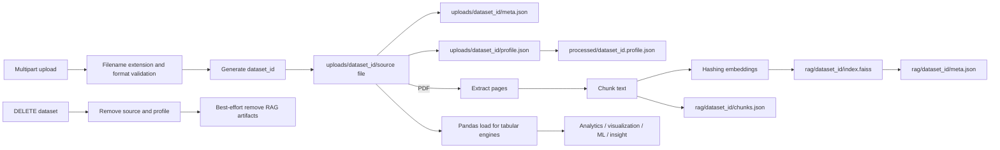
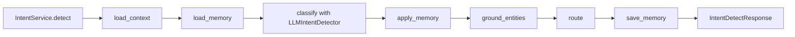
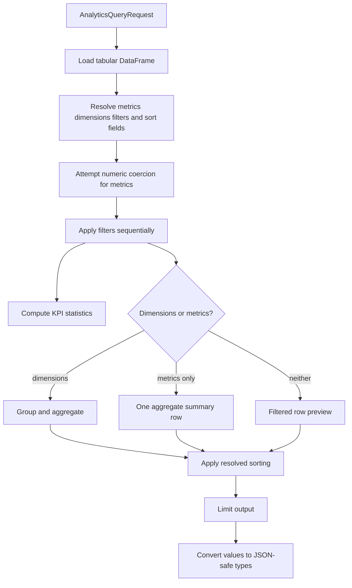
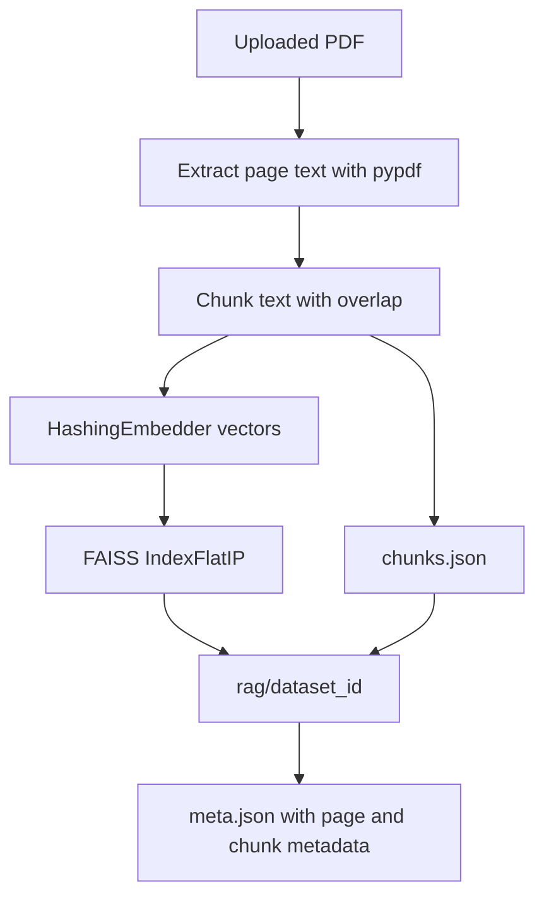
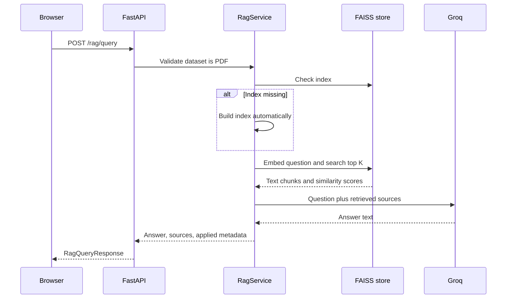

# InsightFlow AI
## Complete End-to-End Technical Report

**Report date:** 2026-08-19  
**Repository:** `Insightflow-AI`  
**Current application version:** `0.10.0`  
**Backend phase represented by the code:** Phase 10, Business Insight Engine  
**Document status:** Implementation-grounded technical handoff

---

## 1. Executive Summary

InsightFlow AI is a full-stack business intelligence platform that accepts CSV, Excel, and PDF files, profiles them, interprets natural-language questions, and routes each question to a specialized execution engine.

The platform is intentionally hybrid:

- **Deterministic processing** handles upload validation, profiling, filtering, aggregations, chart data preparation, and classical machine learning.
- **LLM processing through Groq** handles intent classification, PDF answer synthesis, and business insight synthesis.
- **LangGraph** orchestrates intent detection, conversation memory, entity grounding, and routing.
- **FastAPI** exposes the backend API.
- **React, Vite, Tailwind CSS, Axios, and Plotly** provide the browser application.
- **Local JSON/filesystem storage** is the active persistence layer. A SQLite URL exists in configuration, but there is no active database repository or ORM integration in the current implementation.

The principal user workflow is:

1. Upload a supported file.
2. Store the file under a generated dataset ID.
3. Validate and profile it automatically.
4. Select the dataset in the React UI.
5. Ask a natural-language question.
6. Detect intent and extract grounded entities.
7. Route to analytics, visualization, ML, RAG, insight, or profiling.
8. Execute the selected engine.
9. Render structured results, tables, charts, sources, or insight cards.

The current code is locally runnable and the intent detector was live-verified against the Groq model `qwen/qwen3.6-27b` available to the configured key during this review.

---

## 2. Product Scope and Design Principles

### 2.1 Supported business capabilities

| Capability | User intent | Execution engine | Primary output |
|---|---|---|---|
| Analytics | KPIs, totals, averages, counts, filters, rankings | Pandas analytics engine | Aggregated rows and KPI statistics |
| Visualization | Bar, line, pie, or scatter chart | Plotly visualization engine | Plotly figure JSON and preview rows |
| Machine learning | Forecasting, segmentation, anomaly detection | scikit-learn-based ML modules | Summary, preview rows, optional Plotly figure |
| Document question answering | Questions about PDF contents | FAISS retrieval plus Groq synthesis | Answer plus source chunks |
| Business insight | Explanation, recommendation, root cause | Evidence pack plus Groq synthesis | Headline, explanation, findings, causes, recommendations |
| Dataset profiling | Schema, quality, missingness, duplicates | Pandas/PDF profiling service | Structured profile |

### 2.2 Core principles visible in the code

1. Deterministic computation is preferred for calculations.
2. The LLM receives schema metadata or processed evidence where possible rather than raw datasets.
3. Services own application orchestration; engines own domain computation.
4. Pydantic schemas define the API contract.
5. Dataset IDs isolate storage artifacts.
6. Domain exceptions are converted into HTTP responses at route boundaries.
7. Configuration is environment-driven through `pydantic-settings`.

---

## 3. Repository Structure

```text
Insightflow-AI/
├── .env.example
├── .gitignore
├── README.md
├── netlify.toml
├── deployment/
│   └── README.md
├── backend/
│   ├── requirements.txt
│   ├── app/
│   │   ├── __init__.py
│   │   ├── main.py
│   │   ├── api/
│   │   │   ├── router.py
│   │   │   └── routes/
│   │   ├── core/
│   │   │   ├── config.py
│   │   │   └── logging.py
│   │   ├── engines/
│   │   │   ├── analytics/
│   │   │   ├── insight/
│   │   │   ├── intent/
│   │   │   ├── ml/
│   │   │   ├── rag/
│   │   │   └── visualization/
│   │   ├── schemas/
│   │   ├── services/
│   │   └── utils/
│   ├── data/
│   │   ├── uploads/
│   │   ├── processed/
│   │   └── rag/
│   └── models/
├── frontend/
│   ├── index.html
│   ├── package.json
│   ├── postcss.config.js
│   ├── tailwind.config.js
│   ├── vite.config.js
│   └── src/
│       ├── App.jsx
│       ├── index.css
│       ├── main.jsx
│       ├── api/client.js
│       ├── components/
│       └── lib/queryRouter.js
└── report-final.md
```

### 3.1 Backend responsibility boundaries

- `api/routes`: HTTP endpoints, dependency injection, exception-to-HTTP conversion.
- `services`: application workflows and coordination between dataset storage, schemas, and engines.
- `engines`: domain computation and LLM interaction.
- `schemas`: request and response validation.
- `core`: configuration and logging.
- `utils`: file, CSV, DataFrame, and path helpers.

### 3.2 Frontend responsibility boundaries

- `App.jsx`: application state and end-to-end user workflow.
- `api/client.js`: Axios API calls and common error extraction.
- `lib/queryRouter.js`: converts intent entities into engine request payloads.
- `components`: UI presentation and user interaction.
- `index.css`: design tokens, layout utilities, and visual styling.

---

## 4. Runtime Architecture



### 4.1 Process startup

The backend entry point is `backend/app/main.py`.

`create_app()` performs these actions:

1. Loads cached settings using `get_settings()`.
2. Configures application logging.
3. Creates a FastAPI application with title, version, description, debug mode, and lifespan hooks.
4. Parses the comma-separated CORS origin list.
5. Installs `CORSMiddleware`.
6. Includes the aggregate API router under `settings.api_prefix`, normally `/api/v1`.
7. Registers a root endpoint containing links to major capabilities.

The lifespan startup hook creates these directories:

- `backend/data/uploads`
- `backend/data/processed`
- `backend/models`
- `backend/data/rag`

The exported ASGI object is `app`, so the documented server command is:

```powershell
cd backend
.\.venv\Scripts\Activate.ps1
python -m uvicorn app.main:app --reload --reload-dir app --host 0.0.0.0 --port 8000
```

### 4.2 Router registration

`backend/app/api/router.py` registers these route modules:

- health
- datasets
- intent
- analytics
- visualization
- RAG
- ML
- insight

All are mounted beneath the configured API prefix.

---

## 5. End-to-End User Flow



### 5.1 Frontend initialization

`frontend/src/main.jsx` mounts `<App />` under `React.StrictMode`.

`frontend/src/App.jsx` initializes:

- dataset list
- selected dataset ID
- active profile
- query text
- chat messages
- busy/uploading/deleting states
- API status
- chart, analytics, RAG, ML, and insight result state
- last intent response
- session ID

On mount, the app calls `healthCheck()`. If successful, it marks the API online and loads datasets. Selecting a dataset triggers `getDatasetProfile()`.

### 5.2 Upload flow

The dataset panel accepts a file and calls `uploadDataset(file)` in `frontend/src/api/client.js`. The backend then:

1. Requires a filename.
2. Sanitizes the filename.
3. Detects `csv`, `excel`, or `pdf` from the extension.
4. Generates a random hexadecimal UUID dataset ID.
5. Creates `backend/data/uploads/{dataset_id}`.
6. Streams the upload to disk in 1 MB chunks.
7. Enforces `MAX_UPLOAD_SIZE_MB`, default 25 MB.
8. Validates the stored file format.
9. Profiles the file.
10. Writes `profile.json` and `meta.json`.
11. Writes a compact summary to `backend/data/processed/{dataset_id}.profile.json`.
12. Automatically indexes PDFs in FAISS.
13. Returns dataset metadata to the browser.

If profiling fails, the upload directory is cleaned up and the request fails. PDF RAG indexing is intentionally non-fatal: a PDF can remain uploaded even if automatic indexing fails, with the error recorded in metadata.

### 5.3 Query flow

`App.jsx` rejects a query if:

- the query is empty,
- there is no selected dataset, or
- another request is already running.

The browser first calls `detectIntent(query, selectedId, sessionId)`. The intent response contains both semantic classification and a deterministic engine handoff plan.

The frontend then uses `target_engine` to select one engine call. `queryRouter.js` translates LLM entities into request payloads and adds browser-side safeguards such as:

- default chart type `bar`
- aggregation defaults
- highest/lowest query sorting
- ML task inference
- time-column selection
- insight mode inference
- normalized filters

The final response is added to the chat transcript and the correct result state is rendered.

---

## 6. Dataset Lifecycle and Storage Model



### 6.1 Dataset metadata

`DatasetMeta` contains:

- `dataset_id`
- original filename
- stored filename
- dataset type
- content type
- byte size
- upload timestamp
- extensible `extra` metadata

`extra` is used for preview columns, detected CSV encoding, row and column counts, duplicate rows, missing values, PDF page count, and RAG indexing state.

### 6.2 File safety

The implementation includes several basic protections:

- uploaded filenames are sanitized;
- file size is checked while streaming and after writing;
- dataset IDs reject path separators and `..`;
- only known file extensions are accepted;
- encrypted PDFs are rejected;
- invalid or empty files are rejected;
- failed uploads are removed.

### 6.3 Persistence limitations

The active registry is directory scanning plus JSON files. `DATABASE_URL` is present in `Settings`, but no active database connection, migration, model, or repository layer was found.

Consequences:

- dataset listing is local-host state;
- concurrent multi-instance deployments will not share state automatically;
- filesystem backup and lifecycle policy are external responsibilities;
- deleting a dataset depends on best-effort cleanup for RAG artifacts;
- a host replacement can lose all user data unless the data directory is separately persisted.

---

## 7. Dataset Profiling

The profiling implementation lives in `backend/app/services/profiling_service.py`.

### 7.1 CSV and Excel profiling

For tabular files, the service computes:

- row count
- column count
- duplicate row count
- total missing-value count
- per-column dtype
- non-null count
- null count
- null percentage
- unique count
- numeric descriptive statistics: count, mean, standard deviation, min, quartiles, and max
- top five categorical values
- first five sample rows
- memory usage
- original filename
- column names
- CSV encoding used

CSV loading attempts these encodings in order:

1. UTF-8
2. UTF-8 with BOM
3. Windows CP1252
4. Latin-1

Latin-1 is deliberately last because it accepts almost any byte sequence and can hide an incorrect encoding.

### 7.2 PDF profiling

PDF profiles contain document metadata rather than tabular statistics:

- page count
- a first-page text sample up to 500 characters
- original filename
- a note directing the user to RAG for document questions

Scanned, image-only PDFs may successfully upload but produce no extractable RAG chunks.

---

## 8. Intent Detection and LangGraph Routing

### 8.1 Intent categories

The supported intent names are:

- `analytics`
- `visualization`
- `ml`
- `rag`
- `insight`
- `profile`
- `unknown`

The target engines are:

- `analytics`
- `visualization`
- `ml`
- `rag`
- `insight`
- `profiling`
- `none`

`profile` maps to the `profiling` target engine. `unknown` maps to `none`.

### 8.2 LangGraph execution



The graph is compiled with a process-wide `MemorySaver` checkpointer. The request session ID becomes the LangGraph `thread_id`; requests without a session ID use `anonymous`.

### 8.3 Context loading

If a dataset ID is supplied, `load_context` obtains:

- dataset type
- row count
- column count
- page count
- column descriptors
- column names

For tabular datasets, it first uses the cached profile. For a missing profile, it falls back to preview columns in metadata.

The context is schema metadata only. Raw rows are not placed in the intent prompt.

### 8.4 LLM classification

`LLMIntentDetector` uses `ChatGroq` with:

- `GROQ_API_KEY`
- `GROQ_MODEL`
- `INTENT_TEMPERATURE`, default `0.0`

The system prompt requires one JSON object containing intent, confidence, rationale, and entities such as metrics, dimensions, filters, chart type, ML task, features, time column, clusters, and horizon.

The parser accepts:

- plain JSON;
- JSON wrapped in a Markdown code fence;
- JSON embedded in surrounding text.

The detector normalizes confidence to `[0.0, 1.0]`, validates the intent against the supported set, and returns an `IntentMatch`.

### 8.5 Entity grounding

After classification, `ground_entities` compares entity fields against actual dataset column names. This prevents invented LLM column names from reaching deterministic engines.

The prompt also directs the LLM to:

- use exact schema names;
- distinguish filter values from columns;
- preserve prior conversation entities for follow-ups;
- treat explicit chart requests as visualization;
- choose valid numeric and date fields for ML;
- route document questions to RAG;
- route greetings and unrelated text to unknown.

### 8.6 Conversation memory

A session memory store records recent turns including query, intent, engine, entities, and dataset ID. Memory can:

- carry dimensions and metrics into follow-up questions;
- swap a metric when the user asks a follow-up such as “what about profit”;
- add a filter for a value such as “Technology”;
- reset the active topic for closings such as “done” or “thanks”.

### 8.7 Route plan

The route node produces:

- selected engine;
- ready/planned status;
- phase label;
- human-readable routing message;
- `EnginePass` with `accepted`, `execute_now`, and `next_action`.

Important distinction: intent routing does not execute the selected engine. The frontend performs the second API call after receiving the routing result.

### 8.8 Intent error behavior

Missing `GROQ_API_KEY` produces a 503-level service error. Provider failures are logged with a stack trace and surfaced as an actionable runtime message.

The current local model was changed to `qwen/qwen3.6-27b` after verifying that the configured Groq key could access it. Model availability is account-specific; production deployments should validate the selected model during deployment checks.

---

## 9. Analytics Engine

The analytics endpoint is:

```text
POST /api/v1/analytics/query
```

Request fields include:

- dataset ID
- metric columns
- dimension/group-by columns
- filters
- aggregation functions
- sort definitions
- result limit
- KPI toggle

Supported aggregations:

- `sum`
- `mean`
- `count`
- `min`
- `max`
- `median`

Supported filters:

- `eq`
- `ne`
- `gt`
- `gte`
- `lt`
- `lte`
- `contains`
- `in`

### 9.1 Execution algorithm



For grouped queries, columns are flattened into names such as `sales_sum`, `sales_mean`, and `sales_count`.

For non-numeric metric columns, the engine falls back to count-only aggregation. Numeric conversion handles common string-formatted numeric values through `ensure_numeric_series`.

The response includes:

- row count before filtering;
- row count after filtering;
- applied normalized query details;
- KPI dictionary;
- result rows;
- result count.

---

## 10. Visualization Engine

The visualization endpoint is:

```text
POST /api/v1/visualization/chart
```

Supported chart types in the backend contract:

- bar
- line
- pie
- scatter

The engine reuses analytics filtering and column resolution, then prepares a chart-specific DataFrame.

### 10.1 Chart rules

- bar, line, and pie require at least one metric and one dimension;
- scatter requires two metrics, or one metric plus one dimension;
- numeric metrics are coerced before plotting;
- grouped values are aggregated and sorted;
- charts are limited before serialization;
- Plotly Express creates the figure;
- `plotly.io.to_json()` converts the figure into a browser-safe JSON payload.

The response contains:

- chart type;
- title;
- applied configuration;
- data preview;
- Plotly figure JSON;
- library name `plotly`.

The frontend’s `ChartPanel` renders the returned figure with `react-plotly.js`.

---

## 11. Machine Learning Engine

The ML endpoint is:

```text
POST /api/v1/ml/run
```

The supported tasks are:

- `forecast`
- `segmentation`
- `anomaly`

### 11.1 Task selection

The backend infers a task from query keywords when `task` is omitted:

- segmentation keywords: segment, cluster, clustering, customer group;
- anomaly keywords: anomaly, outlier, unusual, fraud;
- forecast keywords: forecast, predict, next month, future, time series, projection;
- otherwise forecast is the fallback.

The frontend also performs a preliminary inference when constructing its payload.

### 11.2 Forecasting

The forecast module receives:

- target metric;
- time column;
- horizon;
- result limit;
- deterministic random state.

The query router deliberately avoids treating a bare integer year column as a timestamp when a real date column is available.

The implementation selects a valid target and date field using the schema and helper logic, prepares a time series, trains the configured forecasting approach, and returns forecast rows and a summary.

### 11.3 Segmentation

Segmentation selects numeric features, scales them as required by the implementation, fits a clustering model, and returns cluster labels, summary information, preview rows, and optional scatter visualization.

The intent prompt requests two different continuous numeric plot fields to avoid low-information striped charts.

### 11.4 Anomaly detection

Anomaly detection selects numeric features or a target, fits the anomaly model with configured contamination and random state, and returns anomaly labels/scores with optional scatter visualization.

### 11.5 ML artifacts

Each successful run attempts to persist a compact summary to:

```text
backend/models/{dataset_id}/{task}_last.json
```

Persistence is non-critical. If artifact writing fails, the API can still return the ML result and logs a warning.

---

## 12. Retrieval-Augmented Generation (RAG)

RAG is PDF-only and uses:

- `pypdf` for text extraction;
- deterministic text chunking;
- a local hashing embedder;
- FAISS inner-product search;
- Groq for answer synthesis.

### 12.1 RAG indexing flow



Index storage contains:

- `index.faiss`
- `chunks.json`
- `meta.json`

The default RAG settings are:

- chunk size: 800 characters;
- overlap: 120 characters;
- top K: 4;
- embedding dimension: 384;
- synthesis temperature: 0.0.

### 12.2 RAG query flow



RAG returns source chunk IDs, page numbers, scores, and text excerpts so the UI can display provenance.

Scanned image-only PDFs may have a valid file and page count but no searchable text, resulting in a clear “no extractable text” error.

---

## 13. Business Insight Engine

The insight endpoint is:

```text
POST /api/v1/insight/analyze
```

Supported modes:

- `explanation`
- `recommendation`
- `root_cause`

### 13.1 Evidence-first design

`InsightService` obtains:

- dataset metadata;
- cached profile;
- a DataFrame for tabular datasets;
- no DataFrame for PDF datasets.

`InsightEngine` builds an evidence pack through `build_evidence_pack`. The evidence pack can contain profile statistics, focused metrics, focused dimensions, derived summaries, and optional ML context.

The LLM receives the evidence pack, question, and resolved mode. It does not receive the raw dataset as the primary prompt input.

### 13.2 Insight response

The engine normalizes LLM JSON into:

- headline;
- explanation;
- findings with severity;
- recommendations with priority;
- root causes with confidence;
- evidence;
- applied metadata;
- provider.

The response parser supports fenced or embedded JSON and bounds the number of returned findings, recommendations, and root causes.

---

## 14. Backend API Reference

All endpoints below assume the default prefix `/api/v1`.

### Health and root

| Method | Path | Purpose |
|---|---|---|
| GET | `/` | Welcome payload and endpoint links |
| GET | `/health` | Liveness and environment/version metadata |

### Datasets

| Method | Path | Purpose |
|---|---|---|
| POST | `/datasets/upload` | Upload, validate, profile, and persist CSV/Excel/PDF |
| GET | `/datasets` | List stored datasets |
| GET | `/datasets/{dataset_id}` | Read dataset metadata |
| GET | `/datasets/{dataset_id}/profile` | Read cached or generated profile |
| POST | `/datasets/{dataset_id}/profile` | Refresh profile |
| DELETE | `/datasets/{dataset_id}` | Remove dataset and related artifacts |

### Intent

| Method | Path | Purpose |
|---|---|---|
| POST | `/intent/detect` | Classify query, ground entities, and return route plan |
| GET | `/intent/catalog` | List supported intent categories |

### Analytics and visualization

| Method | Path | Purpose |
|---|---|---|
| POST | `/analytics/query` | Deterministic filtering and aggregation |
| POST | `/visualization/chart` | Build Plotly bar, line, pie, or scatter chart |

### RAG

| Method | Path | Purpose |
|---|---|---|
| POST | `/rag/index` | Build or reuse a PDF FAISS index |
| GET | `/rag/{dataset_id}/status` | Read index state |
| POST | `/rag/query` | Retrieve PDF chunks and synthesize an answer |

### ML and insight

| Method | Path | Purpose |
|---|---|---|
| POST | `/ml/run` | Run forecast, segmentation, or anomaly detection |
| POST | `/insight/analyze` | Generate explanation, recommendation, or root cause |

### Error contract

Route handlers catch domain-specific exceptions and return FastAPI `HTTPException` responses with a `detail` string. The frontend extracts the detail using `getErrorMessage()`.

Typical status classes:

- `400`: invalid request, unsupported type, bad column, malformed filter;
- `404`: missing dataset, missing index, missing file;
- `503`: missing LLM credentials or external LLM failure;
- `201`: successful upload;
- `204`: successful deletion.

---

## 15. Frontend Architecture

### 15.1 Main components

- `App.jsx`: state container and workflow coordinator.
- `DatasetPanel.jsx`: upload, list, select, delete, and profile snapshot.
- `ChatPanel.jsx`: query composer and conversation history.
- `ResultsPanel.jsx`: intent, profile, analytics, ML, RAG, and insight output.
- `ChartPanel.jsx`: Plotly chart renderer.
- `ProfileCard.jsx`: profile summary renderer.
- `ErrorBoundary.jsx`: UI-level failure containment if used by the current component tree.

### 15.2 HTTP client

`frontend/src/api/client.js` creates one Axios instance:

```javascript
baseURL: import.meta.env.VITE_API_BASE_URL || "/api/v1"
timeout: 120000
```

In local Vite development, `/api` is proxied to `http://127.0.0.1:8000` by `frontend/vite.config.js`.

The client exposes functions for:

- health;
- datasets;
- profiles;
- intent;
- analytics;
- charts;
- RAG;
- ML;
- insights.

### 15.3 UI state model

The application keeps separate state for each engine result so a new result can replace the visible engine output while preserving the chat history.

Important state transitions:

- analytics clears RAG, ML, and insight output;
- visualization clears analytics, RAG, ML, and insight output;
- RAG clears analytics, ML, insight, and chart output;
- ML creates a chart state when the response includes a Plotly figure;
- insight clears analytics, RAG, and ML output;
- profile requests clear engine result state.

### 15.4 Visual system

The interface uses:

- Manrope from Google Fonts;
- Tailwind CSS utilities;
- CSS custom properties for colors and spacing;
- charcoal, mint, purple, amber, and neutral tones;
- responsive two-panel layout;
- a slide-out dataset panel;
- result blocks with lightweight reveal animation;
- a separate visualization section.

---

## 16. Configuration and Environment

Configuration is defined in `backend/app/core/config.py` and loaded from:

1. repository `.env`;
2. `backend/.env`;
3. process environment variables, subject to Pydantic settings precedence.

Important settings:

| Variable | Purpose | Default |
|---|---|---|
| `APP_ENV` | Environment label | `development` |
| `DEBUG` | FastAPI debug behavior and logging | `true` |
| `API_HOST` | Backend bind host | `0.0.0.0` |
| `API_PORT` | Backend port | `8000` |
| `API_PREFIX` | API route prefix | `/api/v1` |
| `GROQ_API_KEY` | Groq authentication | empty |
| `GROQ_MODEL` | Groq chat model | `qwen/qwen3.6-27b` |
| `INTENT_TEMPERATURE` | Intent LLM temperature | `0.0` |
| `UPLOAD_DIR` | Upload root | `backend/data/uploads` |
| `PROCESSED_DIR` | Processed summaries | `backend/data/processed` |
| `MODEL_DIR` | ML artifacts | `backend/models` |
| `RAG_DIR` | FAISS indexes | `backend/data/rag` |
| `MAX_UPLOAD_SIZE_MB` | Upload limit | `25` |
| `CORS_ORIGINS` | Comma-separated browser origins | localhost origins |
| `RAG_CHUNK_SIZE` | RAG chunk size | `800` |
| `RAG_CHUNK_OVERLAP` | RAG overlap | `120` |
| `RAG_TOP_K` | Default retrieved chunks | `4` |
| `RAG_EMBEDDING_DIM` | Hashing embedding size | `384` |
| `ML_DEFAULT_HORIZON` | Forecast horizon | `7` |
| `ML_DEFAULT_CLUSTERS` | Cluster count | `3` |
| `ML_ANOMALY_CONTAMINATION` | Anomaly contamination | `0.05` |
| `ML_RANDOM_STATE` | Reproducibility seed | `42` |
| `INSIGHT_TEMPERATURE` | Insight synthesis temperature | `0.1` |
| `DATABASE_URL` | Reserved database setting | SQLite URL, currently unused |

### Security note

The local `.env` file contained a live-looking Groq API key during repository inspection. Secrets must not be committed or copied into reports. That key should be revoked/rotated and replaced. `.env` should remain ignored by version control.

---

## 17. Dependencies

### Backend

- FastAPI and Uvicorn: HTTP API and ASGI runtime.
- Pydantic Settings: typed configuration.
- python-dotenv: environment loading.
- pandas and openpyxl: CSV/Excel processing.
- pypdf: PDF validation and extraction.
- NumPy: numerical support and serialization handling.
- Plotly: chart generation.
- LangGraph: intent orchestration and memory checkpointing.
- LangChain Core: message abstractions.
- LangChain Groq: Groq chat integration.
- FAISS CPU: vector retrieval.
- scikit-learn: classical ML.
- pytest and httpx: declared testing tools.

### Frontend

- React and React DOM: UI runtime.
- Axios: HTTP client.
- Plotly.js and react-plotly.js: chart rendering.
- Vite: development server and build.
- Tailwind CSS, PostCSS, and Autoprefixer: styling pipeline.

---

## 18. Deployment and Operations

### 18.1 Frontend deployment

The root `netlify.toml` builds from the repository root:

```text
npm --prefix frontend install && npm --prefix frontend run build
```

It publishes:

```text
frontend/dist
```

A SPA redirect sends all paths to `/index.html`.

`frontend/netlify.toml` also exists and assumes `frontend` as the Netlify base directory. Only one deployment configuration should be treated as authoritative for a given hosting setup.

### 18.2 Backend deployment

`deployment/README.md` describes a future AWS EC2 plus Nginx backend and a separately hosted frontend. The main README mentions Vercel, while the repository contains Netlify configuration. Phase 11 is still marked pending.

A production deployment needs:

1. Python runtime and backend virtual environment.
2. Installed backend requirements.
3. Persistent storage for uploads, processed profiles, RAG indexes, and ML artifacts.
4. Secure `GROQ_API_KEY` injection.
5. A verified accessible `GROQ_MODEL`.
6. Production `CORS_ORIGINS`.
7. Reverse proxy configuration.
8. HTTPS and request size limits.
9. Process supervision for Uvicorn.
10. Backup and cleanup strategy for filesystem data.

### 18.3 Recommended health checks

- Liveness: `GET /api/v1/health`.
- Smoke upload: upload a small CSV and retrieve its profile.
- Intent smoke test: run a simple analytics query through `/intent/detect`.
- Engine smoke tests: analytics, visualization, ML, PDF indexing/query, and insight.
- Storage check: verify write permissions for all configured directories.
- Groq check: list or validate the configured model during deployment, without logging the API key.

---

## 19. Testing and Verification State

### 19.1 What was verified during this report

- Backend source modules compile successfully with Python `compileall`.
- Editor diagnostics reported no errors in the edited configuration and intent detector modules.
- The configured Groq key returned an accessible model catalog.
- A real intent detection request succeeded with `qwen/qwen3.6-27b`.
- The previous failure was reproduced as Groq `404 model_not_found` for `llama-3.3-70b-versatile`.

### 19.2 Test coverage status

The repository declares `pytest` and `httpx`, and stale `.pytest_cache` metadata references intent tests, but no maintained `backend/tests` source directory was present in the workspace snapshot. A full test run therefore reported no tests collected.

This is a significant engineering gap. The highest-value tests to add are:

- upload validation and cleanup;
- CSV encoding fallback;
- profile statistics;
- dataset path traversal rejection;
- analytics filters and all aggregations;
- chart input validation;
- intent JSON parsing and entity grounding;
- conversation memory follow-ups;
- RAG chunking, persistence, retrieval, and empty-text PDFs;
- ML field selection and task inference;
- insight evidence-pack construction;
- API route status/error contracts;
- frontend payload builder behavior.

---

## 20. Risks, Gaps, and Recommended Next Steps

### 20.1 Security risks

- No authentication or authorization layer is present.
- Dataset upload, deletion, analytics, ML, RAG, and insight endpoints appear callable by any client that can reach the API.
- The local environment file contained a credential and must be rotated.
- CORS defaults are local-only and must be explicitly configured for production.
- Uploaded files are stored on local disk without an external object-store policy.
- There is no documented malware scanning or content-disarm process for uploads.

### 20.2 Reliability risks

- Groq model availability is account- and date-dependent.
- LLM failures can block intent, RAG answers, and insights.
- The active storage registry is not transactional.
- No database or distributed lock protects concurrent writes.
- FAISS indexes are local and not shared across replicas.
- Automatic PDF indexing during upload can make upload latency depend on document size.
- There is no job queue for long-running profiling, indexing, ML, or insight work.

### 20.3 Correctness risks

- LLM JSON output remains a dependency even though parsers are defensive.
- LLM-generated entity selection can be wrong despite prompt rules and grounding.
- Classical ML quality depends on automatic feature and date selection.
- Root-cause output is generated reasoning over evidence, not causal inference.
- RAG uses hashing embeddings rather than semantic transformer embeddings, so retrieval quality may be limited for paraphrased questions.
- The frontend and backend both contain query/task heuristics, creating a possibility of drift.

### 20.4 Maintainability gaps

- There is no maintained automated test suite in the workspace snapshot.
- The root README references files not present in the workspace snapshot, including `PROJECT_CONSTITUTION.md` and `backend/README.md`.
- Deployment documentation and hosting configuration are inconsistent.
- The configured SQLite URL is misleading while persistence remains filesystem-based.
- Some service code uses private dataset-service methods to stamp RAG metadata, indicating a boundary that could be formalized.

### 20.5 Prioritized roadmap

#### Priority 1: protect and stabilize

1. Rotate the exposed Groq key.
2. Add authentication and authorization.
3. Add request logging with correlation IDs but never log secrets.
4. Add model availability and credential checks to startup/readiness.
5. Add automated tests for each API group.
6. Make production CORS and upload limits explicit.

#### Priority 2: make state production-ready

1. Move dataset metadata to a database.
2. Move uploads, profiles, RAG indexes, and artifacts to durable object storage or a persistent volume.
3. Add cleanup, retention, and backup jobs.
4. Add a job queue for PDF indexing and long ML/insight operations.
5. Add concurrency protection around dataset and index writes.

#### Priority 3: improve AI quality

1. Replace hashing embeddings with a semantic embedding model where operationally appropriate.
2. Add structured-output support or provider-native JSON schema enforcement.
3. Centralize query heuristics so frontend and backend share one contract.
4. Add evaluation datasets for intent classification, entity grounding, RAG retrieval, and insight faithfulness.
5. Add citations or evidence references to insight responses where business decisions require auditability.

#### Priority 4: clarify deployment

1. Select one frontend deployment target: Netlify or Vercel.
2. Finish the backend deployment guide.
3. Add environment-specific configuration examples.
4. Define a production architecture for persistent files and replicas.
5. Add CI for frontend builds, backend compile checks, linting, and tests.

---

## 21. Final System Assessment

InsightFlow AI has a coherent modular architecture and a clear hybrid-AI strategy. The most complete path is the tabular workflow: upload, profile, intent route, deterministic analytics/chart/ML execution, and structured browser rendering. PDF RAG and business insights are also implemented end to end, but depend on external Groq availability and local FAISS/filesystem state.

The current implementation is suitable as a development or single-host prototype. It is not yet production-ready for untrusted public traffic because authentication, durable shared persistence, secrets hygiene, automated tests, deployment consistency, and operational controls are incomplete.

The most urgent operational action is credential rotation followed by a production-safe model configuration and a backend restart. The most valuable engineering investment after that is a focused test suite covering every route and every storage/LLM boundary.

---

## 22. Source Map

Key implementation files reviewed for this report:

- `backend/app/main.py`
- `backend/app/api/router.py`
- `backend/app/api/routes/*.py`
- `backend/app/core/config.py`
- `backend/app/core/logging.py`
- `backend/app/services/dataset_service.py`
- `backend/app/services/profiling_service.py`
- `backend/app/services/analytics_service.py`
- `backend/app/services/visualization_service.py`
- `backend/app/services/intent_service.py`
- `backend/app/services/rag_service.py`
- `backend/app/services/ml_service.py`
- `backend/app/services/insight_service.py`
- `backend/app/engines/analytics/*`
- `backend/app/engines/visualization/*`
- `backend/app/engines/intent/*`
- `backend/app/engines/rag/*`
- `backend/app/engines/ml/*`
- `backend/app/engines/insight/*`
- `backend/app/schemas/*.py`
- `backend/app/utils/*.py`
- `frontend/src/App.jsx`
- `frontend/src/api/client.js`
- `frontend/src/lib/queryRouter.js`
- `frontend/src/components/*.jsx`
- `frontend/src/index.css`
- `frontend/vite.config.js`
- `frontend/package.json`
- `netlify.toml`
- `deployment/README.md`
- `README.md`
